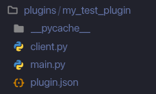
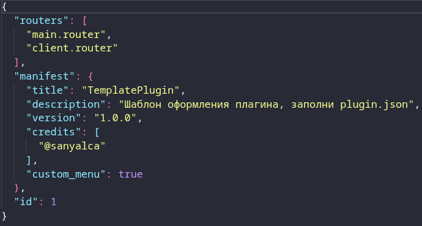
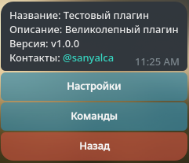
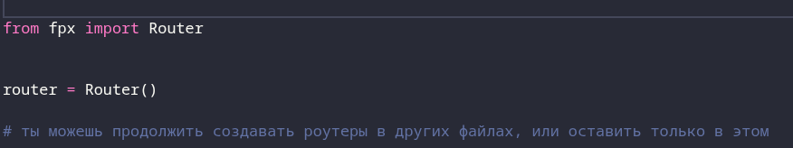
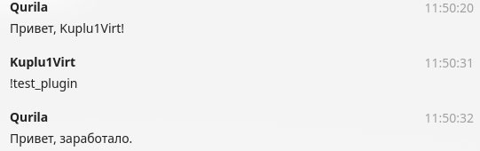

Руководство по созданию плагинов
Ниже перечислены шаги по созданию своего плагина на fpx

1) В корне проекта находим plugins/, в ней создаём папку, название допустим my_test_plugin/
2) Запускаем fpx через python funpayx
3) Возвращаемся в папку, благодаря шаблонам мы имеем в папке client.py, main.py, plugin.json.

4) Заходим в plugin.json и видим подобную картину:

5) Теперь опишу каждое значение:    
    * routers: Список, который перечисляет пути до каждого роутера будь то роутер fpx или роутер aiogram. Как мы видим по дефолту уже создался путь до шаблонных файлов.
    * mainfest: 
        * title: Название плагина
        * description: Описание плагина
        * version: Версия плагина
        * credits: Список контактов разработчиков
        * custom_menu: Используется ли кастомное меню (советую всегда оставлять true). Если сделать false то будет использовано дефолтное меню без каких-либо функций, по дефолту в client.py уже создаётся простое кастомное меню которое можно менять
    * id: НЕ ИЗМЕНЯТЬ!!! Динамичный ID плагина, который может меняться
6) После первичной настройки plugin.json мы уже можем перезагрузить бота, и проверить раздел Плагины в меню:

7) Как можно заметить, мы имеем уже довольно приятную картину, теперь залезем в сам функционал, зайдём в папку main.py, не обязательно заполнять именно её, можем красиво сделать по папочкам на каждый роутер всё красиво, но для примера сделаю примитивно. Изначально видим подобную картину:

8) Давайте напишем первый хендлер, для этого используем фреймворк **[fpx](https://github.com/bymyforge/fpx)**
```python
from fpx import Router, types


router = Router()


@router.on_message(text='!test_plugin')
async def test_plugin_handler(message: types.Message):
    await message.answer('Привет, заработало.')
```
9) Окей, сделали тестовый роутер, теперь перезапускаем бота

10) По дефолту у меня стоит автоответик, как видим обычное сообщение задетектил автоответчик, а вот то на котрое мы создали хендлер обработано абсолютно по другому.
Вот и всё, простейший плагин с лёгкостью написан, по всем вопросам обращайтесь в телеграм @sanyalca